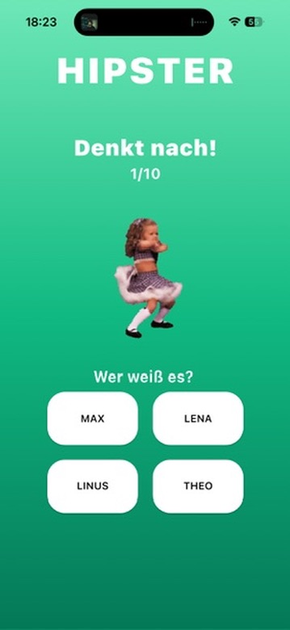
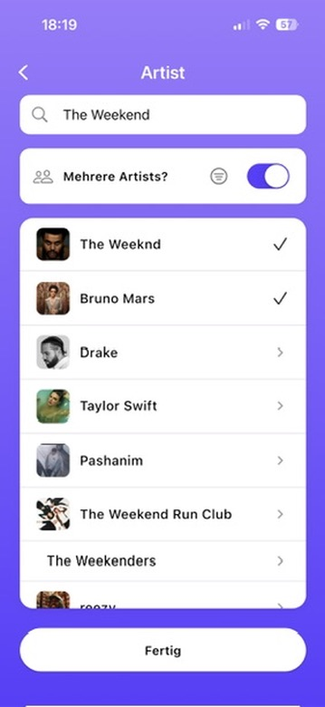
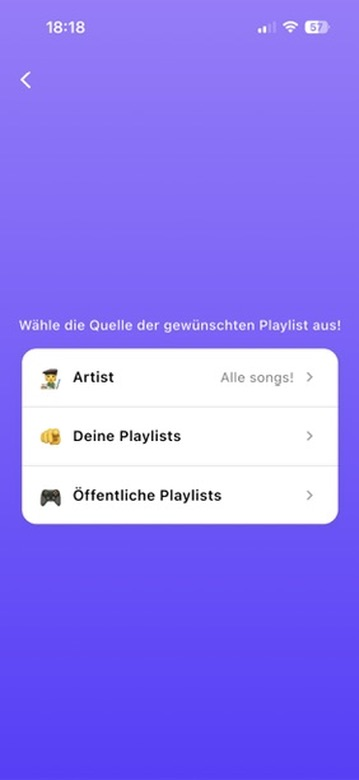

# HIPSTER 🎵

A fast-paced music trivia game powered by Spotify. Challenge friends to guess song titles and artists with seamless Spotify Connect control.


## 🛠️ Technology Stack

### Core Framework
- **Flutter 3.8.1+** - Cross-platform UI framework
- **Dart** - Programming language
- **Provider** - State management solution

### Spotify Integration
- **Spotify Web API** - Playlist/artist search, device management, and playback control via Spotify Connect
- **OAuth (PKCE)** - Secure authentication via `flutter_web_auth_2`
- **Env Loading** - `flutter_dotenv` for local credentials

### Key APIs & Services
- **Spotify Web API Endpoints**:
  - `/v1/me/playlists` - User playlists
  - `/v1/search` - Artist and playlist search
  - `/v1/artists/{id}/top-tracks` - Artist's popular tracks
  - `/v1/me/player/devices` - Available playback devices
  - `/v1/me/player` - Playback control and transfer
- **Flutter Web Auth 2** (`flutter_web_auth_2: ^4.1.0`) - OAuth authentication
- **Shared Preferences** - Local data persistence

### UI & Animation Libraries
- **Cupertino Icons** - iOS-style icons
- **Font Awesome Flutter** (`font_awesome_flutter: ^10.11.0`) - Icon library
- **Wave** (`wave: ^0.2.2`) - Wave animations
- **Confetti** (`confetti: ^0.8.0`) - Celebration effects
- **GIF Support** (`gif: ^2.3.0`) - Animated GIF rendering

### Development & Build Tools
- **Flutter Launcher Icons** (`flutter_launcher_icons: ^0.14.4`) - App icon generation
- **Change App Package Name** (`change_app_package_name: ^1.5.0`) - Package management
- **Rename** (`rename: ^3.1.0`) - Project renaming utilities
- **Flutter Lints** - Code quality and style enforcement

### Platform Support
- **iOS** and **Android** - Full app support; playback occurs on your active Spotify device via Connect
- **Web/Desktop** - Development only

### Security & Authentication
- **Spotify OAuth (PKCE)** - Uses `.env` to store client id and config

## 🎮 Features

- **Spotify Connect Control**: Start/pause, skip, and transfer playback to selected device
- **Flexible Sources**: Your playlists, public playlists, or artists
- **Artist Multi-Select**: Select multiple artists and fetch all songs with a progress dialog
- **Multiplayer Support**: Add multiple players and track scores in real-time
- **Customizable Rounds**: Set the number of rounds
- **Clean UI**: Modern, responsive interface with smooth animations
- **Persistent Settings**: Preferences and players persisted
- **Confirmation Dialogs**: To prevent accidental selections

## 📱 Screenshots

<p>
  
  
</p>
<p>
  
  
</p>

## 🚀 Getting Started

### Prerequisites

- **Flutter SDK** (3.8.1 or higher)
- **Dart SDK** (included with Flutter)
- **Spotify Premium account**
- **Spotify app logged in on any device** (phone, desktop, smart speaker) to act as the playback target
- **Spotify Developer account** (for API access)

### Installation

1. **Clone the repository**
   ```bash
   git clone <your-repo-url>
   cd hitsterclone
   ```

2. **Install Flutter dependencies**
   ```bash
   flutter pub get
   ```

3. **Create Spotify App**
   - Go to [Spotify Developer Dashboard](https://developer.spotify.com/dashboard)
   - Create an app and add redirect URI: `hipsterclone://callback`
   - Copy your Client ID

4. **Create .env** (auto-ignored by Git)
   - In `hitsterclone/`, create `.env` using `.env.example` as a template:
   ```env
   SPOTIFY_CLIENT_ID=your_client_id
   SPOTIFY_REDIRECT_URI=hipsterclone://callback
   SPOTIFY_SCOPES=user-read-playback-state user-modify-playback-state user-read-currently-playing playlist-read-private playlist-read-collaborative user-top-read
   ```

5. **Bundle .env**
   - Add `.env` to `flutter/assets` in `pubspec.yaml` (see snippet above)

6. **Install dependencies**
   ```bash
   flutter pub get
   ```

7. **Run the app**
   ```bash
   # iOS
   flutter run -d ios
   # Android
   flutter run -d android
   ```

4. **Run the app**
   ```bash
   # For iOS
   flutter run -d ios
   
   # For Android
   flutter run -d android
   
   # For Web (development only)
   flutter run -d web
   ```

### Platform-Specific Setup

#### iOS
- Ensure you have Xcode installed
- Open `ios/Runner.xcworkspace` in Xcode for signing if needed
- Ensure `CFBundleURLSchemes` includes `hipsterclone` in `ios/Runner/Info.plist`

#### Android
- Ensure you have Android Studio installed
- Configure your Android SDK and emulator

## 🎯 How to Play

1. **First Launch**: Confirm Spotify Premium
2. **Setup**
   - Connect to Spotify and authorize the app
   - Choose a playback device from available Spotify devices (the one currently active or transfer to your preferred device)
   - Add players
   - Choose a source:
     - `Artist`: enable “Mehrere Artists?” for multi-select; tap “Fertig” to fetch all songs (with progress)
     - `Deine Playlists`: pick one of your playlists
     - `Öffentliche Playlists`: search public playlists
   - Tap the selected summary card to preview all selected songs
   - Set the number of rounds
3. **Game Flow**:
   - Songs play automatically from your selected source
   - Players press their button when they know the song
   - First player to press gets to guess
   - Mark guesses as correct/incorrect
   - Scores update automatically
   - Game ends after all rounds, showing the winner

## 🏗️ Project Structure

```
lib/
├── main.dart                 # App entry point and routing
├── StartUpPage.dart         # Welcome/onboarding screen
├── SetupPage.dart           # Main game configuration
├── AddPlayersPage.dart      # Player management
├── PlaylistSourcePage.dart  # Music source selection
├── SearchPlaylistPage.dart        # Public playlist search
├── ArtistSelectionPage.dart       # Artist search + multi-select
├── PlaylistScreen.dart            # Your playlists
├── SelectedSongsPage.dart         # Selected songs preview list
├── GamePage.dart           # Main game interface
├── services/
│   ├── LogicService.dart   # Game state management
│   ├── SpotifyService.dart       # Playback control helpers
│   └── WebApiService.dart        # Spotify Web API integration (auth, devices, playlists, tracks)
├── theme/
│   └── app_theme.dart      # App styling and constants
├── game/
│   └── game_page_logic.dart # Game logic utilities
└── widgets/                # Reusable UI components
```

## 🔧 Configuration

### Spotify API Setup

1. Go to [Spotify Developer Dashboard](https://developer.spotify.com/dashboard)
2. Create a new app
3. Add redirect URI:
   - `hipsterclone://callback`
4. Note your Client ID and Client Secret
5. Update the configuration in `lib/services/WebApiService.dart`

### Environment Variables

Create `.env` in `hitsterclone/` based on `.env.example`:
```env
SPOTIFY_CLIENT_ID=your_client_id
SPOTIFY_REDIRECT_URI=hipsterclone://callback
SPOTIFY_SCOPES=user-read-playback-state user-modify-playback-state user-read-currently-playing playlist-read-private playlist-read-collaborative user-top-read
```

## 🛠️ Development

### Key Dependencies

- `flutter`: UI framework
- `spotify_sdk`: Native Spotify SDK integration
- `provider`: State management
- `shared_preferences`: Local data persistence
- `flutter_web_auth_2`: OAuth authentication
- `font_awesome_flutter`: Icons
- `confetti`: Celebration animations

### Building for Release

#### Android
```bash
flutter build apk --release
# or for app bundle
flutter build appbundle --release
```

#### iOS
```bash
flutter build ios --release
```

### Code Style

This project follows standard Dart/Flutter conventions:
- Use `dart format` to format code
- Run `flutter analyze` to check for issues
- Follow the [Effective Dart](https://dart.dev/guides/language/effective-dart) guidelines

## 🐛 Troubleshooting

### Common Issues

1. **Spotify Authentication Fails**
   - Ensure `.env` contains `SPOTIFY_CLIENT_ID`
   - Confirm redirect URI in Spotify dashboard is `hipsterclone://callback`
   - Ensure iOS `Info.plist` includes URL scheme `hipsterclone`
   - If you see a white screen, verify `.env` is bundled in `pubspec.yaml` assets and perform a full restart (not hot reload)

2. **No Audio Playback**
   - Ensure a Spotify device is active/logged in (phone, desktop, or speaker)
   - Use the device picker in Setup to select or transfer playback
   - If playback fails, open your Spotify app to initialize a device

3. **App Crashes on Startup**
   - Run `flutter clean && flutter pub get`
   - Check that all dependencies are properly installed
   - Ensure you're using the correct Flutter version

### Debug Mode

Run the app in debug mode for detailed error messages:
```bash
flutter run --debug
```

## 📄 License

This project is licensed under the MIT License - see the [LICENSE](LICENSE) file for details.

## 🤝 Contributing

1. Fork the repository
2. Create a feature branch (`git checkout -b feature/amazing-feature`)
3. Commit your changes (`git commit -m 'Add amazing feature'`)
4. Push to the branch (`git push origin feature/amazing-feature`)
5. Open a Pull Request

## 📞 Support

If you encounter any issues or have questions:
- Check the [Issues](../../issues) page
- Create a new issue with detailed information about your problem

## 🎵 Acknowledgments

- Built with [Flutter](https://flutter.dev/)
- Powered by [Spotify Web API](https://developer.spotify.com/documentation/web-api/)
- Inspired by music trivia games and party entertainment

---

**Note**: Requires Spotify Premium. Playback is controlled via Spotify Connect on your active device.
## ⚡ Quick Start

- Requirements: Flutter, Spotify Premium, a logged-in Spotify device (phone/desktop/speaker)
- Create a Spotify app → add redirect URI `hipsterclone://callback`
- Create `.env` in `hitsterclone/` (see template below)
- Bundle `.env` as an asset in `pubspec.yaml`
- Install deps and run:

```bash
flutter pub get
flutter run -d ios   # or -d android
```

Env template:

```env
SPOTIFY_CLIENT_ID=your_client_id
SPOTIFY_REDIRECT_URI=hipsterclone://callback
SPOTIFY_SCOPES=user-read-playback-state user-modify-playback-state user-read-currently-playing playlist-read-private playlist-read-collaborative user-top-read
```

Add `.env` to `pubspec.yaml` assets:

```yaml
flutter:
  uses-material-design: true
  assets:
    - .env
    - assets/data.json
    - assets/gifs/
```
